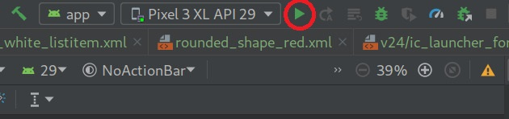
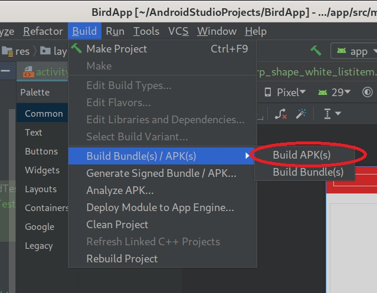
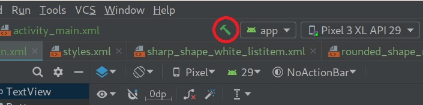

# Bird-Watching-App
I've created an Android Studio app for the preassignment of CGI Future Talent. 
saDSAD

## Usage

### Running and building the application

Suitable for applications that have their own bundler and send the JS bundle
directly to a client (without publishing it to npm). Think of a user-facing app
or website, like an email client, a CRM, a landing page or a blog with
interactive elements, using React/Vue/Svelte lib or vanilla JS.

<b>Show instructions</b>

1. Download or clone this GitHub repository.

2. Open the downloaded project in Android Studio (3.5.3v at the time of uploading) 

### Running, building and making project

Here I have listed ways to start running and building the app into an APK.

* <b> Running project. </b>
Running project will launch the application on an emulated or physical Android device.
In the image the current emulating device is set to Pixel 3 XL.

  

* <b> Building project. </b>
Builds an APK of all modules in the current project for their selected variant. When the build completes, a confirmation notification appears, providing a link to the APK file. The path to file is in <i><b>BirdApp/app/build/outputs/apk/debug/</b></i>

  

* <b> Make project. </b>
Make proejct compiles all the source files in the entire project that have been modified since the last compilation are compiled. 
Dependent source files, if appropriate, are also compiled.

  

